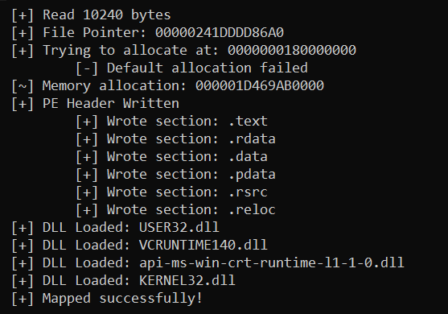

# Process Redirect Mapper
This is a manual mapper which creates a normal Windows process, manually maps a DLL, then replaces the entry thread with a call to the manually mapped DLLs code. Essentially the entry point is replaced, and the manually mapped DLLs entry point becomes the main program loop, the program exits when the function returns.

The result of this allows you to have a process dedicated to running your manually mapped DLL, you can use any process for this, I used calc.exe for this.

